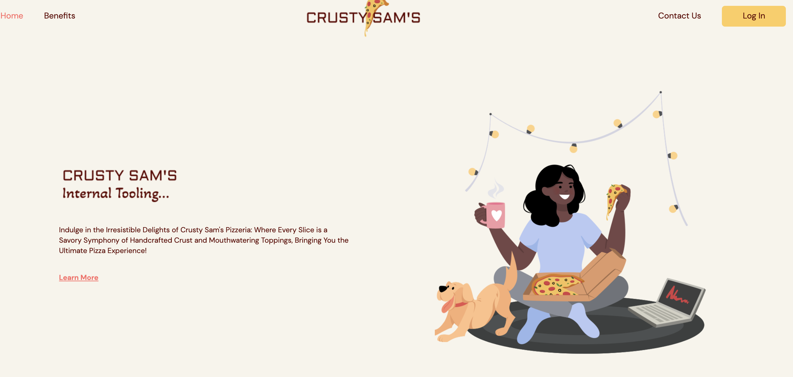

# pizza-Manager

This is a web application for a pizza store management system. It consists of a backend server and a frontend client.

Image:

#### LogIn Credentials (Case sensitive)

There are two users, Chef and Owner.

- UserName: `Owner` Password: `StrongMind`
- UserName: `Chef` Password: `StrongMind`

Rules:
Manage Toppings
As a pizza store owner I should be able to manage toppings available for my pizza chefs.

- It should allow me to see a list of available toppings
- It should allow me to add a new topping
- It should allow me to delete an existing topping
- It should allow me to update an existing topping
- It should not allow me to enter duplicate toppings

Manage Pizzas
As a pizza chef I should be able to create new pizza master pieces

- It should allow me to see a list of existing pizzas and their toppings
- It should allow me to create a new pizza and add toppings to it
- It should allow me to delete an existing pizza
- It should allow me to update an existing pizza
- It should allow me to update toppings on an existing pizza
- It should not allow me to enter duplicate pizzas

Prerequisites
Before running the app, ensure you have the following dependencies installed on your system:

- Node.js
- Yarn
- Docker

Installation

### Local Start up

##### To build backend run `yarn build:clean`

##### To build frontend run `yarn build:local:preview`

##### Access remote app https://pizza-man-391321.web.app/
